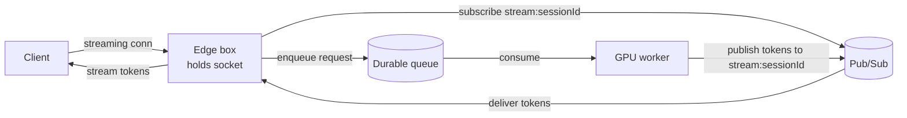

# Routing an Async Response Back to the Caller

The moment you put a queue (or any async hop) between the tier holding the client connection and the worker doing the work, you **destroy the direct relationship** that made returning the result trivial. The worker pulls a job off the queue and has no idea *which* of N front-end boxes is holding that user's open socket. Answering "how does the result find its way home?" is a design step candidates routinely hand-wave — and interviewers routinely probe.

## The problem
- **Synchronous path (easy):** edge box calls the backend and holds the connection; the response returns on the same call. Fine until the backend is a [[wiki/system-design-concepts/serving-constrained-resources|constrained resource]] you must decouple from with a queue.
- **Decoupled path (the trap):** edge enqueues the request and returns; a worker consumes it later. Now the worker → edge affinity is gone. Streaming (token-by-token from an LLM) makes it worse — there are *many* messages to route back, live, for seconds.

## The mechanism: session registry + pub/sub back-channel

1. Each open connection has a **session id**; the edge box that owns the socket **subscribes** to a channel keyed by it (`stream:{session_id}`).
2. The request is **enqueued** on the durable queue carrying its `session_id`.
3. The worker consumes the request, generates, and **publishes** tokens to `stream:{session_id}` on a lightweight pub/sub — it never needs to know which physical box is listening.
4. The subscribed edge box relays tokens to the client.

A **session registry** (which session lives on which box) can be explicit (a KV/directory) or implicit (pub/sub topic subscription). Session→box placement/migration on failure uses [[wiki/theory/consistent-hashing]].

## Two paths, two postures — don't conflate them
- **Durable log** (Kafka): the *request* and *completed turns* — must survive, replayable, feeds other consumers (history, training). Optimized for durability/throughput.
- **Real-time channel** (pub/sub): the *token stream* — must be *fast*, can be lossy-but-reconstructable (on drop, re-fetch the completed turn from the durable store). 

Pushing the token stream *through Kafka* is the smell: wrong tool, huge volume, added latency. Enqueue the request durably; stream tokens over the light channel.

## Key points
- If the client disconnects mid-stream, persist the completed turn and deliver on reconnect (even another device) — the same durable-delivery + per-user watermark machinery as [[wiki/system-design-concepts/read-state-watermarking]].
- The fan-out of tokens to a subscribed connection is [[wiki/system-design-concepts/message-fanout]] with an LLM as the "sender."
- Reflex: **any time you decouple, immediately narrate the return path and what fences correctness at the seam.**

## Interview angle
*30-second answer:* "Once I put a queue between the edge and the worker, the worker no longer knows which box holds the user's socket. So I key each connection with a session id, have the edge subscribe to `stream:{session_id}` on a pub/sub, enqueue the request with that id, and have the worker publish tokens to that channel. The request rides the durable log; the token stream rides a lighter real-time channel — and if the client drops, I persist the completed turn and redeliver on reconnect."

## Connections
- [[wiki/system-design-concepts/serving-constrained-resources]] — the decoupling that creates this problem in the first place
- [[wiki/system-design-concepts/message-fanout]] — pub/sub delivery to the connection holding the socket
- [[wiki/system-design-concepts/read-state-watermarking]] — durable delivery + reconnect/redeliver across devices
- [[wiki/theory/consistent-hashing]] — mapping/migrating sessions to edge boxes
- [[wiki/system-design-concepts/llm-inference-serving]] — the token stream being routed originates here

## Sources
- [[sources/docs/design-chatgpt-mock-interview]] — the hand-waved return path and the durable-vs-real-time separation correction
