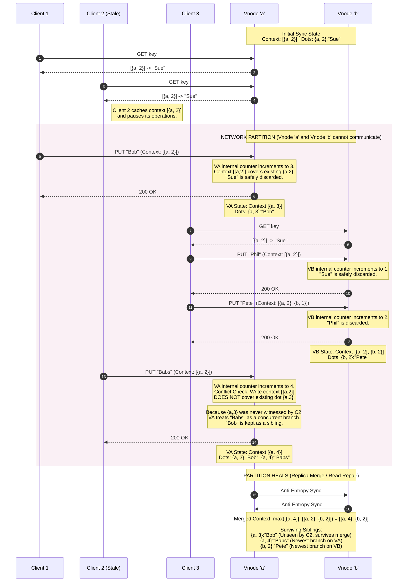

# Vector Clocks

The mechanism that lets a leaderless store answer the question every quorum design eventually hits: *a read returned two different values for one key — are these the same write seen twice, one write that supersedes the other, or two genuinely concurrent writes that conflict?* Wall-clock timestamps can't answer it (clocks skew, and "later" isn't "caused-by"). A **vector clock** can: it tracks *causal history* so any two versions compare as **one-descends-from-the-other** (auto-resolve) or **concurrent** (a true conflict → siblings).

## The one-sentence mental model

> **Tag every version with a per-writer counter map; version A dominates B iff A's counters are all ≥ B's — if neither dominates, the writes are concurrent and must be reconciled as siblings.**

## Why timestamps aren't enough

The naive scheme is **last-write-wins (LWW)**: attach a wall-clock time, highest wins. Two failures, both silent:

1. **Clock skew** — node B's clock runs 50 ms ahead; its *older* write carries a *higher* timestamp and clobbers A's newer one. A real update vanishes with no signal.
2. **Concurrency is invisible** — two clients update the same key at genuinely the same time. LWW picks one; the other is **lost**, and the system never knew there was a conflict to surface.

LWW *can't even detect* the conflict, so it can't ask for help. Vector clocks make "did these causally relate, or happen concurrently?" a decidable question.

## The data structure and rules

A vector clock is a map **`{node → counter}`** — one entry per writer that has ever touched this key. It encodes causal history via three rules:

```
 INCREMENT  a node bumps its OWN counter on each write it coordinates
 MERGE      on receiving a version, take the element-wise MAX of the two maps
 COMPARE    A ≤ B   iff every A[i] ≤ B[i]
            A < B   (B descends from A)   iff A ≤ B and A ≠ B
            A ∥ B   (CONCURRENT/conflict) iff neither A ≤ B nor B ≤ A
```

Worked example — a sequential edit vs a concurrent one:

```
 start:  k = v0  clock {}
 client writes via node A:   A bumps → {A:1}   (v1)
 client reads v1, writes again via A: {A:2}     (v2)   {A:1} < {A:2}  → v2 descends v1, safe

 NOW a partition: two clients write v1 independently
   via A:  {A:2}
   via B:  {A:1, B:1}
   compare {A:2} vs {A:1,B:1}:  A:2 > A:1  BUT  B:0 < B:1
     → neither dominates → CONCURRENT → siblings, must reconcile
```

That last comparison is the whole payoff: the store *detects* the conflict instead of silently dropping a write.

## Example drift and merge with Dotted Version Vectors


## Siblings and reconciliation

When versions are concurrent, the store keeps **both** (siblings) and resolves by one of:

- **LWW on the sibling set** — pick highest timestamp among conflicts. Simple, still lossy, but now a *conscious* choice rather than a silent default.
- **Application merge** — return both to the client, let it merge (Dynamo's shopping cart: union the carts so no add is lost).
- **CRDTs** — types whose merge is mathematically defined (counters, OR-sets), so reconciliation is automatic and deterministic — the modern way to erase the burden.

This is where the convergence family plugs in: [[system-design-concepts/read-repair]] and [[system-design-concepts/anti-entropy-merkle-trees]] use the clock to decide *which* replica is stale (descendant) vs conflicting (sibling), and only overwrite in the safe descendant case.

## The family (don't conflate these)

A common senior-level tell — these are distinct:

| Mechanism | Detects concurrency? | Gives a total order? | Note |
|---|---|---|---|
| **Lamport clock** (scalar) | ❌ no | ✅ yes (with tiebreak) | `a→b ⇒ L(a)<L(b)`, but `L(a)<L(b)` ⇏ causality — can't tell concurrent from ordered |
| **Vector clock** | ✅ yes | partial order only | one counter per node; the structure above |
| **Version vector** | ✅ yes | partial order | same math, term used for *replica* (not process) divergence in storage |
| **Dotted version vector** | ✅ yes | partial order | fixes sibling explosion under many writes to one key (Riak) |

The key distinction: **Lamport gives a total order but *cannot detect concurrency*** (so it can't find conflicts); **vector clocks give only a partial order but *can*** — which is exactly what conflict detection needs. If an interviewer says "just use a Lamport clock to order writes," the correct pushback is that it will silently impose an order on concurrent writes and hide the lost update.

## The cost, and why leader-based skips all this

- **Growth:** the map has an entry per node that ever coordinated a write to the key → it grows with the writer set. Mitigations: prune old entries (with care — pruning can create false concurrency), or **dotted version vectors** to bound sibling growth.
- **Sibling explosion:** pathological write patterns can accumulate many siblings; clients must handle a *set*, not a value.
- **Why leaders sidestep it:** a [[system-design-concepts/per-shard-raft|leader-based]] shard has a **single writer imposing a total order** — there are no concurrent writes to the same key, so *no siblings, no vector clocks needed*. This is a concrete instance of the [[system-design-concepts/leaderless-vs-leader-based|fork]]: leaderless externalizes conflict handling (you run vector clocks + reconciliation); leader-based internalizes it (the log order is the truth). It's a large part of *why* Amazon moved from Dynamo (2007, vector clocks) to DynamoDB (2012, leader-per-partition).

## What to actually memorize
1. **Vector clock = `{node→counter}`**; increment own on write, **merge = element-wise max**, compare element-wise.
2. **A dominates B iff all counters ≥**; neither dominates ⇒ **concurrent ⇒ siblings** (the conflict-detection payoff LWW lacks).
3. **Lamport = total order but can't detect concurrency; vector = partial order but can** — that's the whole reason to pay for vectors.
4. Reconcile siblings by **LWW / app-merge / CRDT**; CRDTs make it automatic.
5. **Grows with the writer set** (prune / dotted version vectors); **leader-based replication needs none of it** (single-writer, no concurrent writes).

## Key points
- The primitive that makes conflict *detection* possible in a leaderless store; LWW-on-timestamps can't detect, only silently pick.
- Encodes a **partial (causal) order**; "concurrent" is a first-class outcome, not an error.
- Distinct from Lamport clocks (total order, no concurrency detection) — conflating them is a classic mistake.
- Cost is vector growth + sibling handling; dotted version vectors and CRDTs are the modern mitigations.
- Entirely unnecessary under single-leader replication — the ordered log *is* the conflict resolver.

## Interview angle

> "Vector clocks are how a leaderless store tells a superseding write from a genuinely concurrent one. Each version carries a map of per-writer counters; you bump your own on a write and take the element-wise max on merge. Then version A dominates B only if all its counters are ≥ B's — and if neither dominates, the writes are concurrent, so I keep both as siblings and reconcile with app-merge or a CRDT rather than silently dropping one, which is what last-write-wins does under clock skew. The distinction I'm careful about is Lamport versus vector: a Lamport clock gives a total order but *can't* detect concurrency, so it hides the conflict; vector clocks give only a partial order but can surface it. The cost is the vector grows with the writer set, so you prune or use dotted version vectors. And the punchline — a single-leader design needs none of this, because there are no concurrent writes to one key; that's a big reason DynamoDB moved off Dynamo's vector-clock model."

## Connections
- [[system-design-concepts/read-repair]] — uses the clock to tell stale (descendant, safe to overwrite) from conflicting (sibling) on a divergent read
- [[system-design-concepts/hinted-handoff]] — when a hinted copy and a later home write meet, the clock decides supersede vs conflict
- [[system-design-concepts/leaderless-vs-leader-based]] — vector clocks are the leaderless conflict-detection tax; leader-based avoids them entirely
- [[theory/consistency-models]] — "concurrent writes → siblings needing reconciliation" is precisely *why* quorum `W+R>N` isn't linearizable
- [[system-design-concepts/anti-entropy-merkle-trees]] — background repair uses version comparison to converge divergent replicas
- [[theory/durability-rpo-rto]] — LWW's silent lost-update is a data-loss (RPO) hazard the clock exposes

## Sources
- [[sources/docs/distributed-kv-store-mock-interview]] — §8 leaderless conflict reconciliation, §9 quorum-not-linearizable (concurrent writes → siblings)
- [distributed-kv-store-mock-interview.md](https://github.com/redblackcoder/interview-prep-wiki/blob/master/sources/docs/distributed-kv-store-mock-interview.md) — full mock-interview design notes
- *Dynamo: Amazon's Highly Available Key-value Store* — DeCandia et al., SOSP 2007 (vector clocks + sibling reconciliation)
